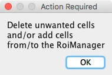

# OligoMacro Toolset
## Introduction
**OligoMacro Toolset**, is an **ImageJ macro-toolset** aimed at isolating oligodendrocytes from wide-field images, tracking isolated cells, characterizing processes morphology along time, outputting numerical data and plotting them. It takes benefit of ImageJ built-in functions to process images and extract data, and relies on the **R software** in order to generate graphs.

**This work has been published in Azevedo, MM, Domingues, HS, Cordelières, FP, Sampaio, P, Seixas, AI, Relvas, JB. Jmy regulates oligodendrocyte differentiation via modulation of actin cytoskeleton dynamics. Glia. 2018; 66: 1826– 1844. <a href="https://doi.org/10.1002/glia.23342">https://doi.org/10.1002/glia.23342</a>. Please cite the paper if using the toolset**

## Pre-requisites
### Having datasets properly formatted
This toolset ONLY deals with images acquired using MicroManager. Images were acquired as timeseries on multiple positions.

Files are ordered by folder/subfolders and named as follows:

* One folder per position: .../**OLIGOS\_08052015\_5**/**Pos0**
	* **OLIGOS\_08052015\_5**: experiment’s name
	* **Pos0**: the position number, starting at 0.
* One image per illumination condition and per timepoint: img\_**000000000**\_**6**\_**Transmission LampOC**\_**000**.tif
	* **000000000**: timepoint (starts at 0)
	* **6**: channel number
	* **Transmission LampOC**: channel’s name
	* **000**: z plane(starts at 0)

* One metadata file per position:
metadata.txt

### Installing the toolset
Copy the toolset file under ImageJ installation folder, in the macros/toolset folder.
Installing the plugins
The OligoMacro Toolset  takes benefit of several ImageJ plugins that should be installed before using it.

* **StackReg**: this plugin performs image registration on a stack, to compensate for repositionning errors taking place during the multi-positionning acquisition. Download the file from the <a href="http://bigwww.epfl.ch/thevenaz/stackreg/"/>EPFL website</a>, and follow the provided instructions to install it.
* **TurboReg**: this plugin is required for StackReg to work. Download the file from the <a href="http://bigwww.epfl.ch/thevenaz/turboreg/"/>EPFL website</a> and follow the provided instructions to install it.

## Tools
The toolset is composed of 5 tools. To launch the OligoMacro toolset, use the rightmost tool of ImageJ toolbar (double red arrow), then select the OligoMacro toolset menu entry: new icons should now be visible:

### Build Stacks

#### What does it do ?
Images were collected by MicroManager. Storing convention is applied, which might make it hard to handle the data. In this first step, all tif files acquired for a single channel, on a single position will be assembled into a unique container: a stack.

#### How does it do it (detailed description) ?
1. The user is requested to point at the **input folder**, which contains the serie of subfolder where data are stored, per position (point at the “experiment’s folder”).
2. The user is requested to point at the **output folder**, where generated data will be stored.
3. The list of all **channels**’ names is built and presented for validation to the user: (s)he may untick unnecessary channels:
 
  

4. As all **timepoints** may not be of interest, the user may restrict the reconstruction to the n first timepoints: this is the purpose of the next dialog box:

  

5. In the output folder, **two subfolders** are generated:
  * output\_folder/**For\_Analysis**/: this folder will accommodate the images and ROIs used for analysis.
  * output\_folder/**For\_Tracking/**: this folder is aimed at storing quality control images and numerical data.
6. For each position, and depending on the selections made for channels and timepoints, individual images are assembled into temporal stacks. Registration is performed on images from the stacks using the StackReg plugin (rigid body algorithm). Finally, the resulting stacks are saved as multi-page tiff files embedded into zip file. The following naming convention is applied: output\_folder/For\_Analysis/**OLIGOS\_08052015\_5**\_**Pos0**\_**Transmission LampOC**.zip
	* **OLIGOS\_08052015\_5**: experiment’s name (last part of the input folder’s path)
	* **Pos0**: position’s number
	* **Transmission LampOC**: channel’s name

#### How to use it (short description) ?
1. Click on the “Build Stacks” tool.
2. Select the **input folder** (point at the “experiment’s folder”).
3. Select an **output folder**, where generated data will be stored.
4. Tick/untick channels to be built.
5. Select the maximum number of timepoints to be reconstructed.
6. The stack building will start, no images will be displayed as it speeds-up the process.

### Detect and Track Cells

#### What does it do ?
This tools deals with cells detection, cells tracking and data extraction. It relies on both automated procedure for image pre-processing and object tracking and user inputs in order to validate detected objects. It outputs two types of data: a table of tabulation-separated values containing all informations about tracked cells, and a ImageJ composite image allowing the experimenter to review both the efficiency of cells’ detection and tracking.

#### How does it do it (detailed description) ?
1. The user is requested to point at the **input folder**, which contains the **reconstructed stacks**. This folder has been generated during previous steps and corresponds to its output folder containing both the **For\_Analysis** and **For\_Tracking**.
2. The user provides parameters for the tracking:
  
  

  * **Max displacement between frames when tracking**: maximum distance travelled by the cell between two successive frames, expressed as a number of pixels (default value: 25 pixels).
  * **Max jump between frames when tracking**: as cells might not all be detectable at all times, this parameters defines the maximum number of frames a cell might be absent from detection before stopping attempts to track it (default value: 5 frames).
  * **Dots size for display**: a quality control image is generated for tracking on which cells are presented as dots. This parameters enable changing the dots’ diameter (default value: 10 pixels).
3. Once the dialog box has been Oked, the following workflow is performed on each transmission temporal stack, aiming at **tracking** cells. **_Only the files which carry the term “Transmission” in their names_** are processed:

  

  3.1. **Pre-processing, step 1: finding cells’ centres**: the following processing is applied for each single image from the stack
  * In order to enhance cells’ borders, a high pass filtering step is performed. The image is heavily blurred using a Gaussian filter (default radius: 10 pixels) and subtracted to the original image.
  * A serie of derivative filters is applied on image’s duplicates (one per duplicate, see filters below), aiming at enhancing cells’ borders in all orientations.

	

    * All filtered images are pulled into a stack from which only the maximum filters’ responses are extracted using a maximum intensity projection.
    * The resulting image is blurred using a Gaussian filter (default radius: 8 pixels).
    * The image is thresholded using the “Default” algorithm.
    * Touching cells are separated using Watershed filtering (from left to right: original image, maximum intensity projection of derivative filtered images, blurred MIP, thresholded MIP).

	

    * The “Analyze Particle” function is used to isolate individual cells (default filter size: 100 pixels to Infinity).
    * The centroid of each individual cell is logged, and used to populate an image where each centre is drawn as a white circle over a black background (default diameter: 15 pixels).
  
  3.2. **Pre-processing, step 2: selecting cells to track**:
  * From the stack where cells centres have been identified, a local maximum search is performed, allowing circular regions of interest to be placed over each detection candidate.

  

  * Each circular ROI is pushed towards ImageJ’s ROI Manager.
  * The user is invited to review the detected cells, and deleted/add unwanted/missed cells.

  

  3.3. **Tracking**: cells are tracked using the nearest neighbour strategy implemented as follows for each validated detection:
  
  * On the dots’ stack, the coordinates of the detection for the cell of interest, from the timepoint t is used to place a circular region of interest. Its diameter is set to correspond to the maximum expected displacement that has been user provided during initial setup (default value: 25 pixels).
    * The subsequent slice from the stack is activated, keeping the ROI intact.
    * A local maximum search is performed within the active ROI: several cases may arise:
      * Only one local maximum is found: it most probably corresponds to the same cell center at time t+1. This position is recorded and used to perform next step of the processing, starting again from step i.
      * Several local maxima are found: for each maximum, its distance to the ROI’s centre is computed. Only the coordinates from the nearest neighbour are retained and processing continues by going back to step i.
      * No local maximum is found: in this specific case, possibility of a lack of detection is evaluated as follow:
        * The circular ROI’s centre is kept.
        * The diameter of the ROI is increased by the maximum displacement value (default value: 25 pixels).
        * Slice corresponding to t+1 is activated.
        * A search for local maxima is performed and same decision rules as above are applied:
          * In the absence of detection, the ROI’s diameter is increased only if the maximum number of missed detection has not yet been reached (default number of gaps: 5);
          * In case of detection, the ROI’s diameter is reset to default value (25 pixels).
    * At the end of each search, a check is performed (experimental) for dead cells. It appears in some cases (not all) that dead cells have a uniform intensity. In case the ratio between standard deviation and average intensity is less than 0.25 within the “maximum displacement” ROI (initial diameter), tracking is cancelled for the current cell.
    * Finally, all coordinates are logged to a results table, containing the following information, sorted per columns:
      * **Track nb**: number of the track.
      * **Slice nb**: slice on which detection has been performed.
      * **X**: x coordinate of the cell.
      * **Y**: y coordinate of the cell.
      * **Distance**: distance in physical units (microns or nanometers) for previous point or -1 in case of the first timepoint.
      * **Cumulated\_Distance**: summed distances travelled from the first timepoint, in physical units (microns or nanometers) or NaN (not a number) in case of the first timepoint.
      * **Velocity**: speed of the displacement, calculated as the ratio between the distance and the time interval between two acquisition (in physical units, ie microns or nanometers per second or minute) or -1 in case of the first timepoint.
      * **Pixel Value**: average intensity of the pixels within a circular ROI of diameter “maximum displacement” (default diameter: 25 pixels) on the original image, at coordinates (X, Y).
    * The results table is saved using the following nomenclature: output\_folder/For\_Tracking/**OLIGOS\_08052015\_5**\_**Pos0**\_**Transmission LampOC**.xls
    	* **OLIGOS\_08052015\_5**: experiment’s name (last part of the input folder’s path)
    	* **Pos0**: position’s number
    	* **Transmission LampOC**: channel’s name
    * The full process is repeated for each single cell, and each single position

  3.4. **Generate quality control image**:
  
  * During the processing, a quality control image is generated, as a ImageJ composite. It is made of 3 channels:
  		* *Channel 1*: filled circular ROIs placed over each detected cell (default diameter: 25 pixels) , over a black background. This channel is intended for visually inspecting for detection efficiency.
  		* *Channel 2*: hollow circular ROIs placed over each cell (default diameter: 32 pixels), one color per cell, over a black background. This channel allows visually inspecting for tracking efficiency.
  		* *Channel 3*: the registered original image, in black and white.
  * The composite image is saved using the following naming convention: output\_folder/For\_Tracking/Check\_tracking\_**OLIGOS\_08052015\_5**\_**Pos0**\_**Transmission LampOC**.zip
	* **OLIGOS\_08052015\_5**: experiment’s name (last part of the input folder’s path)
	* **Pos0**: position’s number
	* **Transmission LampOC**: channel’s name

#### How to use it (short description) ?
Using this tool is pretty straightforward. It requires the data to have been built and registered using previous tool.
1. Click on the “Detect and Track Cells” button.
2. A dialog-box should pop-up where tracking parameters should be set:

  

  * **Max displacement between frames when tracking**: maximum distance travelled by the cell between two successive frames, expressed as a number of pixels (default value: 25 pixels).
  * **Max jump between frames when tracking**: as cells might not all be detectable at all times, this parameters defines the maximum number of frames a cell might be absent from detection before stopping attempts to track it (default value: 5 frames).
  * **Dots size for display**: a quality control image is generated for tracking on which cells are presented as dots. This parameters enable changing the dots’ diameter (default value: 10 pixels). 
3. Each dataset will be loaded and pre-processed in turn. For each, a message should popup-up, requesting the user to delete/add cells that might have been detected erroneously/missed during the segmentation process.
4. For each dataset, two outputs will be generated and saved:
  * A results table, containing the following information, sorted per columns:
      * **Track nb**: number of the track.
      * **Slice nb**: slice on which detection has been performed.
      * **X**: x coordinate of the cell.
      * **Y**: y coordinate of the cell.
      * **Distance**: distance in physical units (microns or nanometers) for previous point or -1 in case of the first timepoint.
      * **Cumulated\_Distance**: summed distances travelled from the first timepoint, in physical units (microns or nanometers) or NaN (not a number) in case of the first timepoint.
      * **Velocity**: speed of the displacement, calculated as the ratio between the distance and the time interval between two acquisition (in physical units, ie microns or nanometers per second or minute) or -1 in case of the first timepoint.
      * **Pixel Value**: average intensity of the pixels within a circular ROI of diameter “maximum displacement” (default diameter: 25 pixels) on the original image, at coordinates (X, Y).
  * The results table is saved using the following nomenclature: output\_folder/For\_Tracking/**OLIGOS\_08052015\_5**\_**Pos0**\_**Transmission LampOC**.xls
		* **OLIGOS\_08052015\_5**: experiment’s name (last part of the input folder’s path)
		* **Pos0**: position’s number
		* **Transmission LampOC**: channel’s name
  * A quality control image is generated, as a ImageJ composite. It is made of 3 channels:
      * *Channel 1*: filled circular ROIs placed over each detected cell (default diameter: 25 pixels) , over a black background. This channel is intended for visually inspecting for detection efficiency.
      * *Channel 2*: hollow circular ROIs placed over each cell (default diameter: 32 pixels), one color per cell, over a black background. This channel allows visually inspecting for tracking efficiency.
      * *Channel 3*: the registered original image, in black and white.

     

	* The composite image is saved using the following naming convention: output\_folder/For\_Tracking/Check\_tracking\_**OLIGOS\_08052015\_5**\_**Pos0**\_**Transmission LampOC**.zip
		* **OLIGOS\_08052015\_5**: experiment’s name (last part of the input folder’s path)
		* **Pos0**: position’s number
		* **Transmission LampOC**: channel’s name

### Cut Out Cells
#### What does it do ?
Using this tool, the user will be able to validate tracked cells and will define the cell body and cell outline areas. Once regions have been set, individual cells will be isolated, then filtered to isolate and quantify processes. Quality control images are generated (one per cell) together with numerical data being exported as files containing tabulation separated values (one per position).

#### How does it do it (detailed description) ?
1. The user is requested to point at the **input folder**, which contains the **reconstructed stacks**. This folder has been generated during previous steps and corresponds to its output folder containing both the **For\_Analysis** and **For\_Tracking**.
2. In turn, each image from the output\_folder/For\_Analysis folder will be loaded (ex: output\_folder/For\_Analysis/**OLIGOS\_08052015\_5**\_**Pos0**\_**Transmission LampOC**.zip), together with the corresponding tracking results table (ex: output\_folder/For\_Tracking/**OLIGOS\_08052015\_5**\_**Pos0**\_**Transmission LampOC**.xls).
	* The user is requested to modify **cell body**’s ROI: by default, a circular ROI is displayed (default diameter: 32 pixels): pressing on space bar validates the current ROI which is added to the ROI Manager, and brings the macro to the next step. NB: validating this step without any ROI defined will result in skipping the current cell for further analysis.
	* The user is requested to modify **cell outline**’s ROI: by default, a circular ROI is displayed (default diameter: 64 pixels): pressing on space bar validates the current ROI which is added to the ROI Manager, and brings the macro to the next step.NB: validating this step without any ROI defined will result in skipping the current cell for further analysis.
	* Both ROIs are combined into a single, hollow ROI, which is added to the ROI Manager. The two former individual ROIs are deleted from the ROI Manager.
	* Steps 2a to 2c are repeated for each tracked cell.
	* Once all cells have been reviewed, the content of the ROI Manager is saved using the following naming convention: output\_folder/For\_Tracking/Check\_tracking\_**OLIGOS\_08052015\_5**\_**Pos0**\_**Transmission LampOC**\_Rois.zip
		* **OLIGOS\_08052015\_5**: experiment’s name (last part of the input folder’s path)
		* **Pos0**: position’s number
		* **Transmission LampOC**: channel’s name
	* For each of the retained cells, an image centered on the tracked cell center is generated and post-processed to extract  remarkable points (processes endpoints and crosspoints):
	
	

	* **Extraction of individual cells**: For each slice of the stack:
		* The cell body and outlines ROI is applied to the original image, centered on the relevant tracked point.
		* In case the ROI is partly located outside of the image; the ROI is adapted by cropping non image overlapping parts.
		* The corresponding image is extracted for the current timepoint.
		* All images for all timepoints are assembled into a stack and saved using the following convention: output\_folder/For\_Analysis/**Pos0**/Cell**1**.zip
			* **Pos0**: position’s number
			* **1**: cell number
	* **Enhancement of cell processes**: On the stack saved at previous step:
		* The image is despeckled (3x3 median filter).
		* The histogram of the image is log-transformed to enhance the low intensity parts of processes.
		* The histogram is equalized to the same aim.
		* In order to enhance processed, a duplicate of the stack is subjected to maximum filtering (radius: 3 pixels), followed by a minimum filtering (radius: 3 pixels): it allows estimating the local background.
		* Finally, the background image is subtracted to the pre-processed image obtained at step 3, to give the background corrected stack.
	* **Isolation of cell processes**: On the background corrected stack:
		* The image is automatically thresholded using the Renyi method.
		* In order to remove small isolated groups of pixels, the “Analyze Particles” function is called (size filter: 10 pixel up to one fourth of the image area) and a size filtered mask is generated.
		* The mask is subjected to skeletonisation.
		* On the skeleton image, the cell body ROI is activated and filled in white: this allows connecting to the cell of interest all its processes. Processes from adjacent cells won’t be connected.
		* The magic wand is activated on the cell body: all connected pixels (cell body and its processes) are isolated as a ROI.
		* Pixels outside of the ROI (cell body and connected processes) are turned to black: this is the final step for connected processes isolation.
	* **Extraction of remarkable points**: On the filtered skeleton obtained at step iii-6:
		* To identify endpoints, the image is first duplicated then submitted to conditional erosion: on pixels lacking 7 neighbours are eroded. This corresponds to endpoint pixels. To isolate endpoints, this image is subtracted to the original skeleton.
		* To identify crosspoints, the image of the skeleton is first duplicated, then submitted to conditional erosion: on pixels lacking 6 neighbours are eroded. This corresponds to pixels where the skeleton is branched. As clustered pixels might be isolated at this step, a search for local maxima is performed, that allows isolating exactly one pixel per branching region. The output of this step is a mask, containing one pixel per crosspoint.
	* **A quality control image** is generated, as a ImageJ composite. It is made of 4 channels:
		* *Channel 1*: endpoints, pseudo-colored in red.
		* *Channel 2*: crosspoints, pseudo-colored in green.
		* *Channel 3*: skeleton, pseudo-colored in blue.
		* *Channel 4*: original image, “Grays” LUT.

		

	* The quality control image is saved, using the following naming convention: output\_folder/For\_Analysis/**Pos0**/Cell**1**\_detections.zip
		* **Pos0**: position’s number
		* **1**: cell number
	* A **results table** is created. It is based on the former results table, containing tracking data, to which processes’ characteristic parameters are added. Overall, the following information are logged, for each cell, at each timepoint:
		* **Track nb**: number of the track.
		* **Slice nb**: slice on which detection has been performed.
		* **X**: x coordinate of the cell.
		* **Y**: y coordinate of the cell.
		* **Distance**: distance in physical units (microns or nanometers) for previous point or -1 in case of the first timepoint.
		* **Cumulated\_Distance**: summed distances travelled from the first timepoint, in physical units (microns or nanometers) or NaN (not a number) in case of the first timepoint.
		* **Velocity**: speed of the displacement, calculated as the ratio between the distance and the time interval between two acquisition (in physical units, ie microns or nanometers per second or minute) or -1 in case of the first timepoint.
		* **Pixel Value**: average intensity of the pixels within a circular ROI of diameter “maximum displacement” (default diameter: 25 pixels) on the original image, at coordinates (X, Y).
		* **Endpoints**: number of endpoints’ pixels.
		* **Crosspoints**: number of crosspoints pixels.
		* **Skeleton**: number of pixels composing the skeleton.
		* **Area**: area of the image (in pixel square).
	* The results table is saved using the following convention, one table per position: output\_folder/For\_Analysis/**Pos0**/**OLIGOS\_08052015\_5**\_**Pos0**\_**Transmission LampOC**\_Rois.zip
		* **Pos0**: position’s number
		* **OLIGOS\_08052015\_5**: experiment’s name (last part of the input folder’s path)
		* **Transmission LampOC**: channel’s name

#### How to use it (short description) ?
To use this tool, the data should have been processed using previous tool.

1. Click on the “Cut Out Cells” button.
2. In turn, each position’s image is loaded and the user is requested to either validate the displayed ROI for cell body localisation and cell extend delineation (see the status bar for instructions). For each ROI, either press the “spacebar” to validate or draw a new ROI then validate.
3. Data for the current position is processed and extracted: the tool generates three types of output:
	* **Extracted cell**: it contains the image of the cell, the cell body (tracked point) being centered on the image.
	* **Quality control image for each cell**: an ImageJ composite made of 4 channels:
		* *Channel 1*: endpoints, pseudo-colored in red.
		* *Channel 2*: crosspoints, pseudo-colored in green.
		* *Channel 3*: skeleton, pseudo-colored in blue.
		* *Channel 4*: original image, “Grays” LUT.
	* **A results table containing data for current position**: for each cell, at each timepoint, the following data are logged:
		* **Track nb**: number of the track.
		* **Slice nb**: slice on which detection has been performed.
		* **X**: x coordinate of the cell.
		* **Y**: y coordinate of the cell.
		* **Distance**: distance in physical units (microns or nanometers) for previous point or -1 in case of the first timepoint.
		* **Cumulated\_Distance**: summed distances travelled from the first timepoint, in physical units (microns or nanometers) or NaN (not a number) in case of the first timepoint.
		* **Velocity**: speed of the displacement, calculated as the ratio between the distance and the time interval between two acquisition (in physical units, ie microns or nanometers per second or minute) or -1 in case of the first timepoint.
		* **Pixel Value**: average intensity of the pixels within a circular ROI of diameter “maximum displacement” (default diameter: 25 pixels) on the original image, at coordinates (X, Y).
		* **Endpoints**: number of endpoints’ pixels.
		* **Crosspoints**: number of crosspoints pixels.
		* **Skeleton**: number of pixels composing the skeleton.
		* **Area**: area of the image (in pixel square).
4. The process iterates from step 2 until all cells from all positions’ images have been processed.

### R

#### What does it do ?
This tools compiles all numerical data into graphical outputs. It computes basic statistical parameters from the raw data, calculating average values, standard deviation and number of value for each individual extracted data, for each position. This tool relies on outputs generated by the toolset and makes use of R software to generate additional outputs.
 
#### How does it do it (detailed description) ?
1. The user is requested to point at the input folder, which contains the numerical data. This folder has been generated during previous steps and corresponds to the folder containing both the For\_Analysis and For\_Tracking.
2. For each position, ImageJ toolset will generate two specific R scripts and run them. The scripts takes the numerical data as an input, extracts the different columns (number of crosspoints, number of endpoints, skeleton length and cumulated travelled distance), pulls the data per timepoint and computes for each parameter the average, the standard deviation and the number of values. For each column, a new file is generated, containing tabulation-separated values. In addition, pdf files are generated, containing plots corresponding to each parameter, plotted as a function of time either for each single cell or averaged for all cells. The output files follow a convention detailed hereafter:

	* In the output\_folder/For\_Analysis/Pos0/ folder:
		* Data output: 4 files
			* **OLIGOS\_08052015\_5**\_**Pos0**\_**Transmission LampOC**\_Average nb crosspoints.csv
			* **OLIGOS\_08052015\_5**\_**Pos0**\_**Transmission LampOC**\_Average nb endpoints.csv
			* **OLIGOS\_08052015\_5**\_**Pos0**\_**Transmission LampOC**\_Average skeleton length.csv
			* **OLIGOS\_08052015\_5**\_**Pos0**\_**Transmission LampOC**\_Cumulated travelled distance.csv
		* R scripts: 2 files
			* OligodendrocytesAnalysis\_**Pos0**\_Individual-Analysis.R
			* OligodendrocytesAnalysis\_**Pos0**\_Global-Analysis.R
		* PDF output: 2 files
 			* **OLIGOS\_08052015\_5**\_**Pos0**\_**Transmission LampOC**.pdf: plots, cell per cell
			* **OLIGOS\_08052015\_5**\_**Pos0**\_**Transmission LampOC**\_Global-Analysis.pdf: plots, averaged amongst all cells
		* **Pos0**: position’s number
		* **OLIGOS\_08052015\_5**: experiment’s name (last part of the input folder’s path)
		* **Transmission LampOC**: channel’s name

			

#### How to use it (short description) ?
1. Click on the “R” button.
2. ImageJ will take care of everything, including generating and executing R scripts: data from each position are processed in turn and generated output saved in the relevant folders.

### Per Condition Data Pulling
#### What does it do ?
This tool is aimed at pulling consecutive positions’ data into a unique subset. It provides a convenient way to group data for subsequent analysis.

#### How does it do it (detailed description) ?
1. The user is requested to point at the **input folder**, which contains the **numerical data**. This folder has been generated during previous steps and corresponds to the folder containing both the **For\_Analysis** and **For\_Tracking**.
2. A dialog box is displayed, asking the user for the first and last position to consider for data pulling. NB: data to pulled should originate from consecutive positions within the list:

		

3. ImageJ toolset will generate a specific R scripts and run it. The scripts concatenates together data table generated using previous tool into unique tables (one per parameter). It also provides a graphical representation of all 5 parameters. The output files follow a convention detailed hereafter.
	* In the output\_folder/For\_Analysis/ folder:
		* Data output: 4 files
			* Pulled\_data\_pos**0**-**49**\_Average nb crosspoints.csv
			* Pulled\_data\_pos**0**-**49**\_Average nb endpoints.csv
			* Pulled\_data\_pos**0**-**49**\_Average skeleton length.csv
			* Pulled\_data\_pos**0**-**49**\_Cumulated travelled distance.csv
		* R scripts: 1 file
			* Pulled\_data\_pos**0**-**49**\_Global-Analysis.R
		* PDF output: 1 file 
			* Pulled\_data\_pos**0**-**49**\_Global-Analysis.pdf
		* **0**: start position
		* **49**: stop position

#### How to use it (short description) ?
1. Click on the “Per Condition Data Pulling” button.
2. ImageJ will take care of everything, including generating and executing R script: data from each selected position are processed and generated output are saved in the relevant folders.

